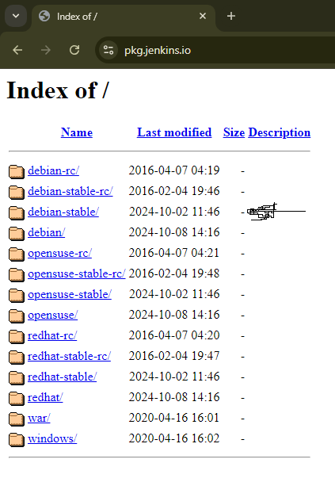

# capstone-project

# TERRAFORM
Initialize and Apply Terraform Configuration:
Initialize Terraform: terraform init

Apply the configuration: terraform apply

 # JENKINS

Launch an ec2 instance on aws 

In your security group ensure to open these ports 443, 8080, 22, 80

ssh into your ec2 instance (in this case i will be using EC2 instance connect)

sudo apt update

sudo apt install openjdk-11-jre

Now;
visit this site on your browser

pkg.jenkins.io

Click debian-stable/

Then copy the copy one by one and paste in your ec2 instance

wget -q -O - https://pkg.jenkins.io/debian/jenkins.io.key | sudo apt-key add -
sudo sh -c 'echo deb http://pkg.jenkins.io/debian-stable binary/ > /etc/apt/sources.list.d/jenkins.list'

sudo apt update

sudo apt-get install fontconfig openjdk-17-jre

sudo apt-get install jenkins

Access your jenkins in you browser with your ec2 public ipv4 address include :8080 at the end of the public ipv4 address

To get Administrator Password
on the jenkins admin page

cat the the directory shown there in your ec2 server you already ssh into
sudo cat /var/lib/jenkins/secrets/initialAdminPassword (you will see on your jenkins page), this command will help you get your admin password

Create an Admin user 

Then you will be taken to another page to customize jenkins

Install all plugins or specific depending on your used case (here i will be installing all recommendded plugins)

You will see Jenkins path Url

Then you will receive a prompt noting that Jenkins is Ready

# CICD with Jenkins

Create New Job with Pipeline
Under pipeline 
* select pipeline script
* select hello world as sample

Run Sample Code

Do Check-out Using Declarative Format

click configure, then click pipeline syntax

From the Sample step
* select checkout: Check out from version control

* provide your git repository url (copy that by clicking code on your git repository)

* click on Add Jenkins, then add your username and password
username: your github account username
password: you need to generate the password from your github by generating a token for Authentication
How to generate password
* go to github
* go to setting (ensure you access the setting from clicking the placeholder for your github profile picture, that's where you can see develpoer settings)
* click developer settings
   - go to personal access tokens
   - click generate new token drop down
   - click generate new token (classic)
   - give any name in the tab called "Note" provided
   - select expiration time from the Expiration* drop down
   - Check all boxes in the Select Scopes 
   - Click generate token

Authentication

Configure Webhook in Github and Jenkins
